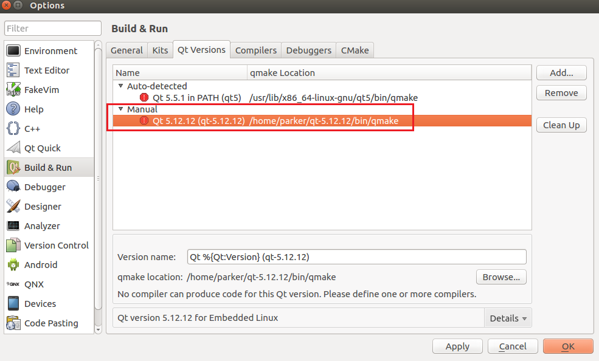

# Cross Compiled Qt setup Guide

+ Download the prebuild files from release, Decompress the file, eg:

```SHELL
sudo tar xvf qt-5.15.5-aarch64.tar.gz -C /opt # put the decompressed file to /opt
```


+ Setup the enviroment

```SHELL
echo "export PATH=/opt/qt-5.15.5-aarch64/bin:$PATH"  >> ~/.bashrc
source ~/.bashrc
```

+ Try qmake

```SHELL
qmake --version
```

And it output:

```SHELL
QMake version 3.1
Using Qt version 5.15.5 in /opt/qt-5.15.5-aarch64/lib
```

Since it's cross compiled, some tools' file format should be x86_64 executable:

```SHELL
$ file qmake
qmake: ELF 64-bit LSB executable, x86-64, version 1 (GNU/Linux), dynamically linked, interpreter /lib64/ld-linux-x86-64.so.2, for GNU/Linux 2.6.32, BuildID[sha1]=d7f1910558815cd62c418101d0e8119ef30b88c8, not stripped
```

And libraires shoule be aarch64 shared object.

```SHELL
$ file libQt5Gui.so.5.15.5
libQt5Gui.so.5.15.5: ELF 64-bit LSB shared object, ARM aarch64, version 1 (GNU/Linux), dynamically linked, BuildID[sha1]=065a01ce1417852f8e90956d8d9da3d08f9416da, stripped
```

## Intergrated with qtcreator

Use your package manager to install the qtcreator.

In most Debian based linux:

```SHELL
sudo apt install qtcreator
```

Or Redhat based:

```SHELL
sudo yum install qt-creator
```


+ Setup in qtcreator

You may create a new QtWidget program to setup the Kits in QtCreator.

1. Open the Kits setup window, select Qt Version, add a new qmake.


2. Select the qmake




3. Set the cross compiler's location:


4. Return to Kits page, apply the settings.


After this, you may try to build test app.

**Note: Your app is for aarch64 linux, so you won't be able to run it in your host system.**

```SHELL
$ file qt-test 
qt-test: ELF 64-bit LSB executable, ARM aarch64, version 1 (SYSV), dynamically linked, interpreter /lib/ld-linux-aarch64.so.1, for GNU/Linux 3.7.0, BuildID[sha1]=11717730db6475913da9a63625356b2acf651d1a, not stripped

# Execute it in your host system is WRONG.
$ ./qt-test 
bash: ./qt-test: cannot execute binary file: Exec format error
```


# Running in target system

+ For most cases, you'll have to copy the libraries to target system in order to correctly execute the app.

```SHELL
sudo tar xvf qt-5.15.5-aarch64.tar.gz -C /opt
```

Edit the `/etc/ld.so.conf` file, add `/opt/qt-5.15.5-aarch64/lib`  to it, then 

```
sudo ldconfig
```


+ If you have installed qt in your target system via package manager, simply copy the binary file would work too.


Target System:

```SHELL
$ uname -m
aarch64
$ dpkg --print-architecture
arm64
```


And program correctly executed.

