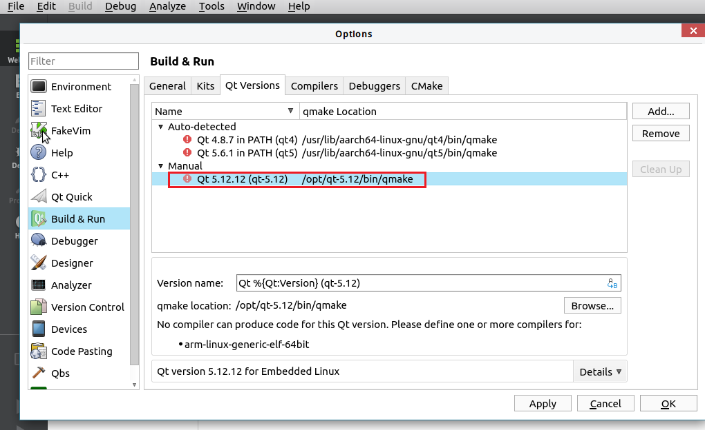
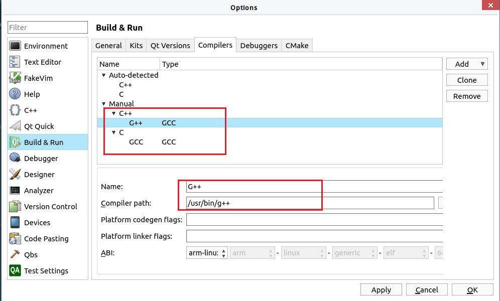
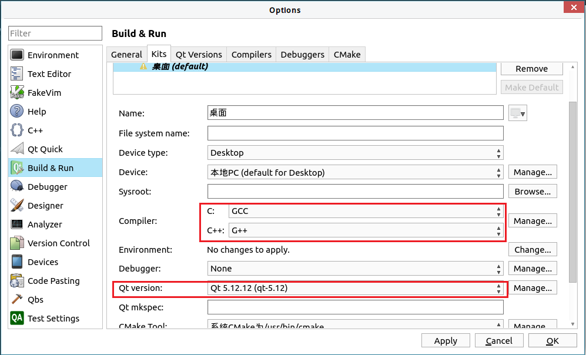

# Native Compiled Qt Setup Guide

+ Download the prebuild release. Extract the file to `/opt`

```SHELL
sudo tar xvf qt-5.12.12-aarch64.tar.gz -C /opt
```

+ Setup enviroment

```SHELL
echo "export PATH=/opt/qt-5.12.12/bin:$PATH" >> ~/.bashrc
source ~/.bashrc
```

+ Try qmake.

```SHELL
qmake --version
```

# Intergrated with qtcreator

1. Setup kits, select Qt Version


2. Select compiler.



3. Apply settings in kits



With the right `qmake` and compiler, you may now build and run your app locally.